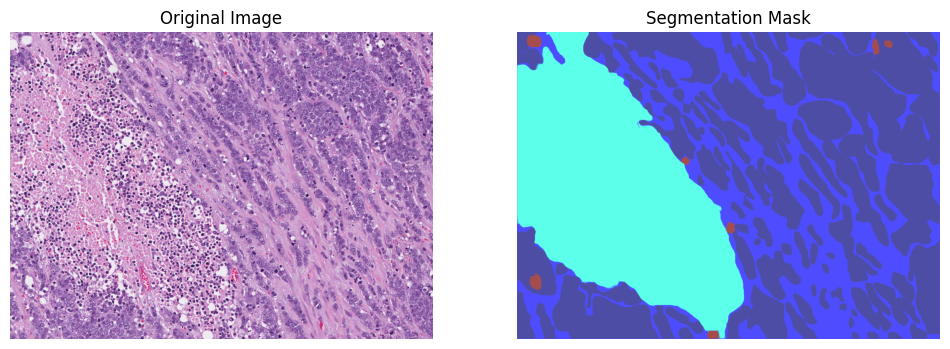
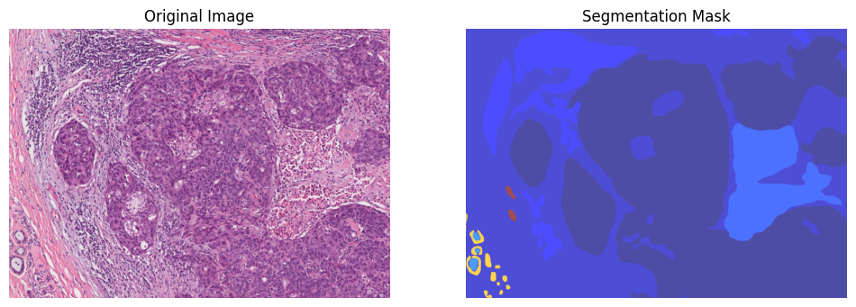
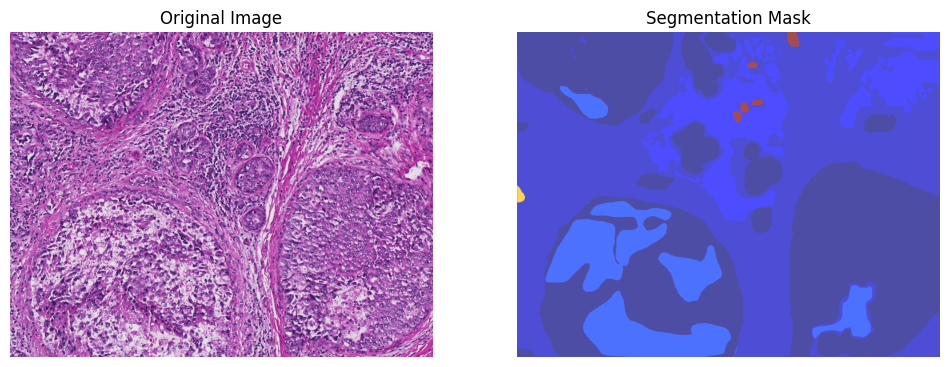

# Testing out Flower Framework on BCCS

Forked from [github.com/PathologyDataScience/BCSS](https://github.com/PathologyDataScience/BCSS). Read the README.md there for installation instructions on the data.
To install dependencies, run, it should work idk:
```bash
python -m venv ./.venv
source ./.venv/bin/activate
pip install -r requirements.txt
```

The data is stored in two directories, images/ and masks/. Images corresponds to the RGB images of breast cancer segmentations, while masks have corresponding grayscale images where the pixel intensity value corresponds to the class of that pixel. The objective is therefore to predict that mask given the image.

Examples where I converted the mask from grayscale to not be ugly:



